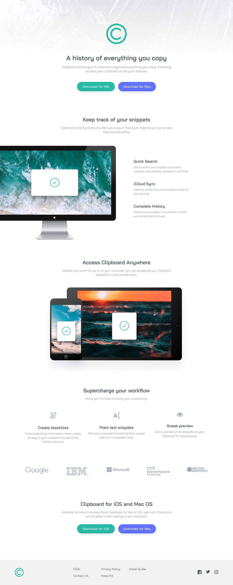
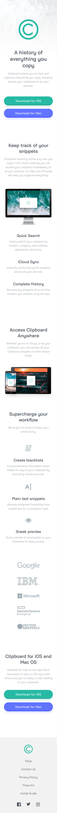

# Frontend Mentor - Clipboard landing page solution

This is a solution to the [Clipboard landing page challenge on Frontend Mentor](https://www.frontendmentor.io/challenges/clipboard-landing-page-5cc9bccd6c4c91111378ecb9). Frontend Mentor challenges help you improve your coding skills by building realistic projects. 

## Table of contents

- [Overview](#overview)
  - [Screenshot](#screenshot)
  - [Links](#links)
- [My process](#my-process)
  - [Built with](#built-with)
  - [Continued development](#continued-development)
- [Author](#author)

## Overview

### Screenshot

### Links

- Live Site URL: [Clipboard landing page](https://clipboard-landing-page-master.dodeun.com/)

## My process

### Built with

- Semantic HTML5 markup
- CSS custom properties
- Flexbox
- CSS Grid
- Mobile-first workflow
- SASS

### Continued development

I did not find a way to make the #section1 nicely responsive, The rules I used to position the computer screen so he could be partially hidden on the left side of the viewport makes the text on the right side do ugly things to some viewports width.

## Author

- Frontend Mentor - [@Dodeun](https://www.frontendmentor.io/profile/Dodeun)